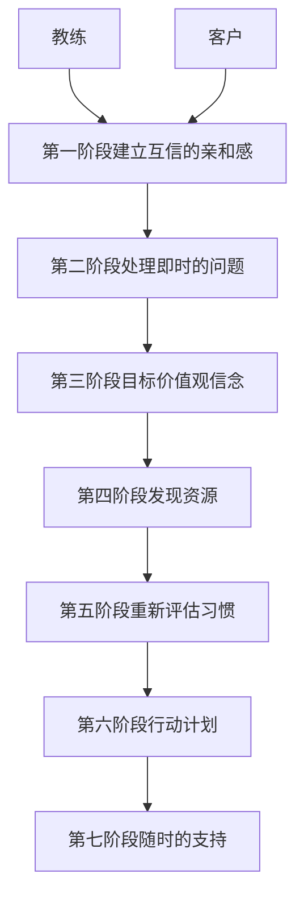

读书打卡第二百一十二天
===

《NLP教练：如何成为大师级教练》（第十三天）
---

### 第六章 问题就是答案

教练过程是结构性的，以下是一个总体的轮廓：

**教练过程的架构**

建立亲和感是第一步。总体架构的第二步是处理客户的即时问题，这是他们需要教练的主要原因。

一旦开始探索客户的即时问题，你就进入了第三阶段：建立客户的目标和价值观。

在此阶段，教练和客户共同工作，把客户的梦想转变为现实，开始实现长期目标。所有的教练过程都基于客户的目标和价值观。

教练如何能完成这种转变呢？在大多数情况下是通过提出好的问题来完成的。

#### 提问的艺术

通过提问可以达到很多目的。

提问有一个特性——你必须要回答问题。他们督促你回忆自己的经历，甚至是回答“我不知道”，你仍然要思考这个问题并且检视自己的经历以回答这个问题。

一个好问题能够开发出一片新的天地。当给客户提出一个有分量的问题时，你就给他们提供了一个从另外的角度审视他们的经验和资源的机会，并且去发现他们没有认识到自己实际拥有的答案。

**假设**

问题可以把客户的焦点指向某一领域，却会忽略其他的方面。

假设就是在你思索问题之前就认为是真实的东西。

所有的问题都包含着假设。如果你想回答问题，就会接受这些假设，或者会拒绝假设，就问题提出问题。他们也许会这样挑战假设：“是什么让你认为我想要些东西？”

提出有力问题的艺术之一，就是在其中设置强有力的假设。很多人提出问题，但其中的假设无效甚至有害。

责备在教练过程中是没有位置的。

有力量的问题包括：
* 从你拥有的资源当中，你认为哪些有助于改善这种状况？（你有很多资源可以选择，而且你的资源能够改善这种状况）
* 什么阻止你变革？（你可以变革）
* 你从这里学到了多少事情？（你能从中学习）

要保证你的问题包含有用且有力的假设。

**同步**

在提问中同步是基础。怎样知道何时要提问呢？让你的问题与直觉相联系。你可以用两种方式训练直觉：
1. 倾听！放松。关闭你的内心对话。问自己：“客户现在需要什么？”
2. 校准你的客户。如果知道他们的身体语言和声调，你就知道他们何时对问题是开放的。

> 错！在何时提问，肯定有可以明说的关系。只是你还没有找到而已。

**诚实**

你如何知道客户的回答是诚实的？你如何知道他们仅仅告诉了你他们认为你想听的东西？

首先，你要在首次约谈中说明教练是如何工作的。你要告诉客户，说明实情并不会让他失去什么，因为教练是为了他们的利益。

其次，你要校准你的客户。这样当他们对问题感到不适和不确定时，你能够从他们的身体语言和音调中得到信息。这时你可以选择离开这个领域还是继续下去。

再次，教练的问题来自于开放的、诚实的、好奇的态度。教练为客户做出诚实的榜样，客户也会做出诚实的回应。

最后，你可以提一些有分量的问题，如：
* 你还观察到什么？
* 如果不在乎我的想法，你怎么会这样说？
* 除了已经说的东西，你还有希望探讨的吗？

**用问题建立亲和感**

提出尖锐的问题而又保持亲和感的主要方式有两种：
1. 你可以提前暗示一个问题。比如，我能问你一个有关什么什么的问题吗？
2. 你可以用声调和筛选过的词语软化你的问题。
    * 假如……，我很想知道有关什么什么的事情。
    * 假如……，我对了解什么什么的事情感兴趣。
    * 你介意告诉我有关什么什么的事情吗？

身体语言、声调和言语一样重要。

**改变感情状态**

提问可以改变客户的感情状态。

可以用不舒服的语调和身体语言或者设定限制性的假设，让客户进入一种无助的状态。反教练方式——让一个基本正常的客户经过教练过程后却感觉更为难受。