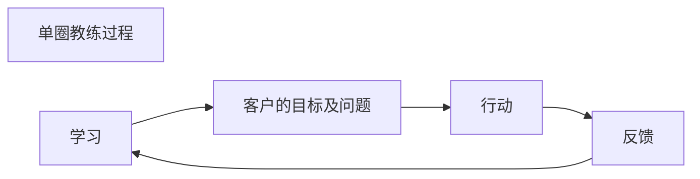
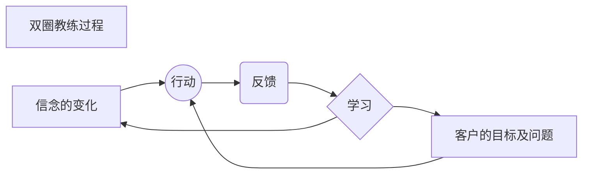

读书打卡第二百一十七天
===

《NLP教练：如何成为大师级教练》（第十八天）
---

### 第七章 信念：生活的准则（一）

信念是你生活的准则，是你赖以生存的原则。这些准则既能够释放和加强，让你实现目标和激活你的价值观，也能成为障碍，让目标成为泡影，或者让你认为自己没有实现目标的能力。

信念是行动的指南，而不是空洞的理论。所以如果你想要知道某人相信什么，就注意他做些什么，而不是听他说些什么。

我们认为信念由每个人的经历形成，反之经历也是信念的结果。

这意味着你可以选择你的信念。

信念可以改变。但是信念可以改变的看法对许多人来讲是具有挑战性的。

#### 对信念进行教练

一些教练过程不需要处理信念问题。这叫做“单圈教练过程”，教练用厘清目标、支持客户采取行动、得到良好反馈的方式帮助他们实现目标，并在这个过程中进行学习。

如果客户对实现他们目标的能力产生怀疑，这时教练就需要探索他们的信念了。

处理信念的教练过程更有力量，因为这不仅解决问题，而且要首先改变问题的思想。这样就使客户的信念进入了反馈轮圈，所以叫做“双圈教练过程”。

这里，客户学习到关于问题的信念本身就是问题的一部分。不仅解决问题，而且在问题之外可以导致新的体验。

你开始和客户就信念问题开始合作的方式之一是给他们一张《信念时间工作表》。这张表格探索了人们不同时期关于年龄、美丽、快乐、家庭、关爱、职业和可能性的信念。这张表格能揭示很多事情，并且说明信念是能改变的。作为重大事件经历或自然进化的结果，信念是可以改变的。

当你与客户讨论正面信念时，要检查他们是否在同一水平上表达了客户的想法。

有时客户把短暂的状态或信念概括出来，却用在了他们身份当中，他们被言语所误导。短暂的负面信念很容易处理。下面是教练应遵守的有用规则：
* 任何负面的信念都是短暂的。任何有力量的信念都是永久的。

> 既负面且有力的信念呢？

即使客户的言语中没有区别，教练也应该教他们加以区分。