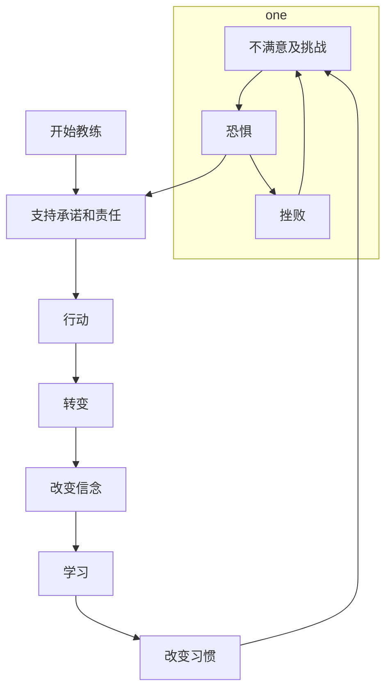

读书打卡第二百二十二天
===

《NLP教练：如何成为大师级教练》（第二十三天）
---

### 第八章 转变时期（一）

在教练过程中，转变时期是最困难的阶段。他们失去了在过去环境中的安全感，但仍未适应新环境。。在这个时期，客户一方面要相信自己的教练，另一方面要相信自己的能力。

这个时候信心是最重要的。

转变期的模式

上图就是转变时期的模式，显示出完整的教练过程。

第一阶段，客户处于某种形式的不满意或是挑战的状态。第二阶段，他们不得不面对自己对改变的恐惧。第一阶段和第二阶段构成了一个循环。“加速器教练过程”是指客户一直在这循环中循环，直到他的处境越来越糟，无法忍受，把自己弹出这个循环。加速器教练过程是痛苦的，但总比没有强得多。

一旦客户跳出恐惧和挫败的循环，他最需要的就是教练的支持。一旦采取行动，他们就进入了一个关键点——转变时期。

这个转变时期的模型是关于“双环教练”的，因为限制性信念可能是客户前进中的障碍的一部分。

有一个需要关注的问题是“失去”。“失去”似乎更像是“部分死亡”；客户需要对他们自己的某一部分（阻碍自己发展的限制性信念）说再见。

当你从转变时期的另一端浮出水面时，太多太多的东西需要去学习了。

最后，完成了这个转变时期后，全新的挑战又会摆在你的面前。

#### 习惯

习惯是我们不假思索做出的行为。他们是非常有用的。当我们想要改变时，这些习惯会阻止我们。

很多习惯是在我们人生中的早期阶段形成的，我们从来没有真正去检查他们。

那么是什么使我们保持一个习惯呢？NLP用“设定心锚”这个词来解释这个现象。设定心锚是这样一个过程：外界的刺激变成了一个开关，这个开关使我们进入某个状态，然后以特定的方式对外界的刺激进行回应。

通向改变的第一个步骤是了解此时此刻你有哪些心锚。参考资料中的“工作表”可以帮助客户更清晰地发现心锚。当客户认识到心锚的力量后，他们会看到特定的心锚怎样引发特定的状态，如果他们想改变，他们可能需要改变某些习惯。这将意味着：
1. 认识到心锚支持着习惯；
2. 创建一个新习惯来支持改变；
3. 设置新的心锚来支持新习惯。

一个对我产生帮助力量的强有力的信念是：我比自己的习惯更有力量。