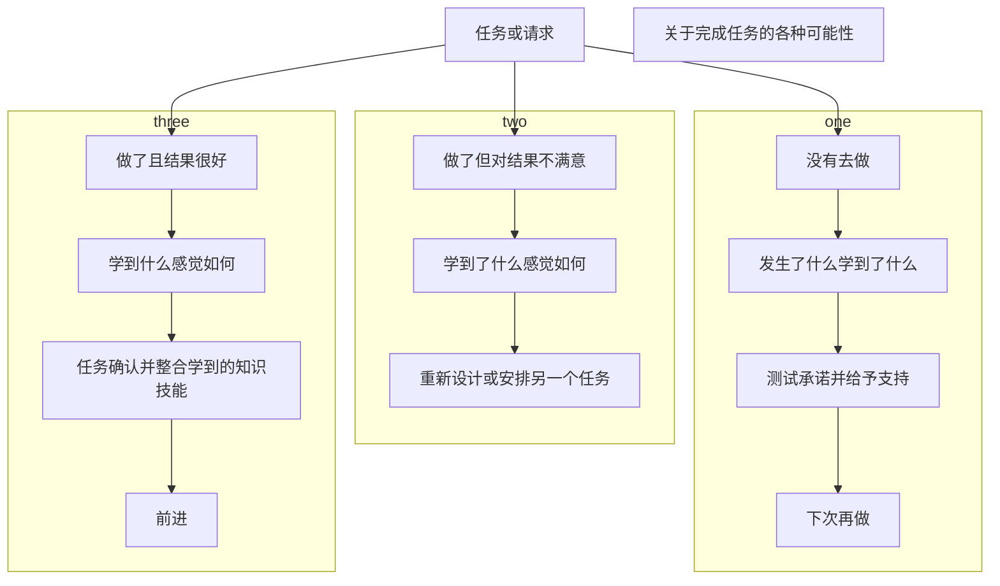

读书打卡第二百二十六天
===

《NLP教练：如何成为大师级教练》（第二十七天）
---

### 第八章 转变时期（五）

#### 任务

**回应**

对于一个请求或挑战，客户可以有三种可能的回应方式：
* 是的。
* 不。客户拒绝。他们不同意承诺完成任务，或是你们之间的亲和关系不够好，也许是客户没准备好去执行任务。
* 磋商。

当客户说他们将“试一试”去完成任务时，要小心。这通常意味着他们不会去做，或者他们猜测任务很难完成。如果他们说要试一试，就请他们改用“好的”、“不行”或是“取决于……”。如果可能的话，和他们磋商一个不同的任务。

同样，当客户说“我可能去做”的时候也要小心，请他们说“我将要去做”。

**结果**

布置任务以后，需要你去检查一下客户所做出的承诺是否身心合一，你还可以帮客户设置一个心锚来提醒他。你可以在下一个教练过程与客户讨论一下任务执行的结果。

如果客户经过了两次教练过程后，还是忘了去完成任务或是借口没时间去做，说明客户不适合完成这个任务。你必须和他们全面地讨论这个问题。永远不要责备客户。他们总会学到一些东西。

另一种可能性是客户完成了任务，但他们认为完成的结果并不好。教练可以和客户讨论这个问题。客户的期望是什么？他们从中学到了什么？针对相同的目标，你可能需要给他们另一个任务。

**责任**
通过教练过程，客户拥有了成果而且要对这个成果负责。教练和客户对教练过程都负有责任，他们是伙伴关系。

责任听起来可能是一个沉重的负担。但是对教练工作来说，责任是“反应—能力”：有能力采取反应。客户有能力对教练设置的任务、请求和挑战采取反应。

这里有三个基本问题帮助客户对他们的行动和任务负责：
1. 你打算做什么？
    * 客户将要采取什么行动？
    * 这些行动应该是建立在客户的目标和价值观的基础上的，应该是清晰的和有时间限制的。
2. 你打算什么时候去做？
    * 所有的行动必须有一个时间计划，否则它们很可能变成空洞的承诺。
3. 你怎么知道？
    * 行动将产生明确的结果，教练需要知道行动已经开始。