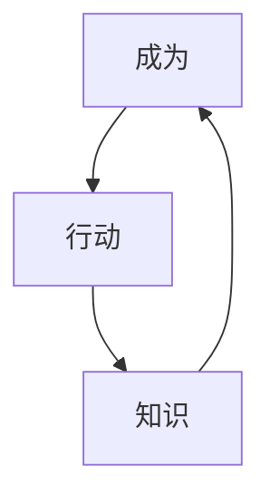
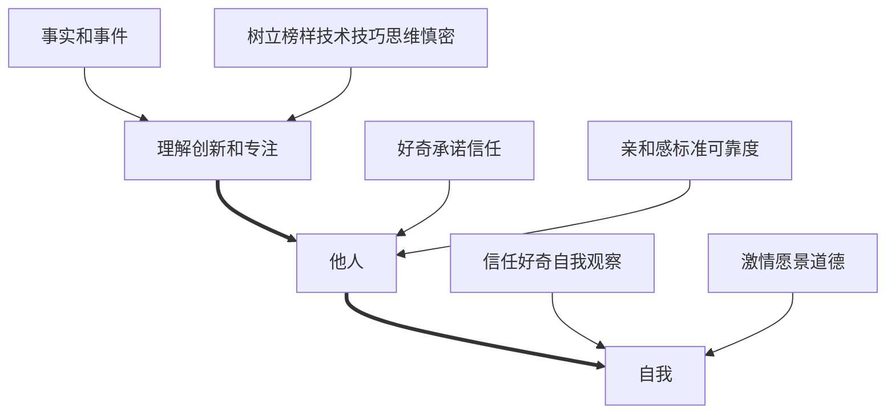

读书打卡第二百三十天
===

《NLP教练：如何成为大师级教练》（第三十一天）
---

### 第十章 教练自己

当你是一个教练的时候，你也是一个领导者，一个领导者有三个主要属性：
* 技能
* 知识
* 提供一个榜样

一个教练在以下三个方面成长：

首先，你拥有技能，你有能力采取行动，你可以创造出不同。你通过能采取的行动而成长。

接下来，你学到了更多知识，你通过所知道的知识拓展你自己。

最后，也是最重要的，你通过树立自己成为客户的榜样而成长。

建立在上述基础上，教练要在以下三个方面提升自己：
* 图中左侧是向内看所看到的品质——教练怎样对待他们自己。
* 图形最上端是身份的领域。这是关于自我管理的。作为教练，你要相信自己，知道你在自己的道德范畴内生活，你还知道自己有能力恪守承诺。
* 在右侧是和其他人相关联的品质。一个好教练要对其他人好奇，人的行为是很有趣的——甚至当他们犯下可怕错误时。人们是怎样在第一天犯了错误而第二天就做得非常好呢？如果你能够时刻保留最好状态，将会怎样？

教练需要带着好奇心充满热情地工作。